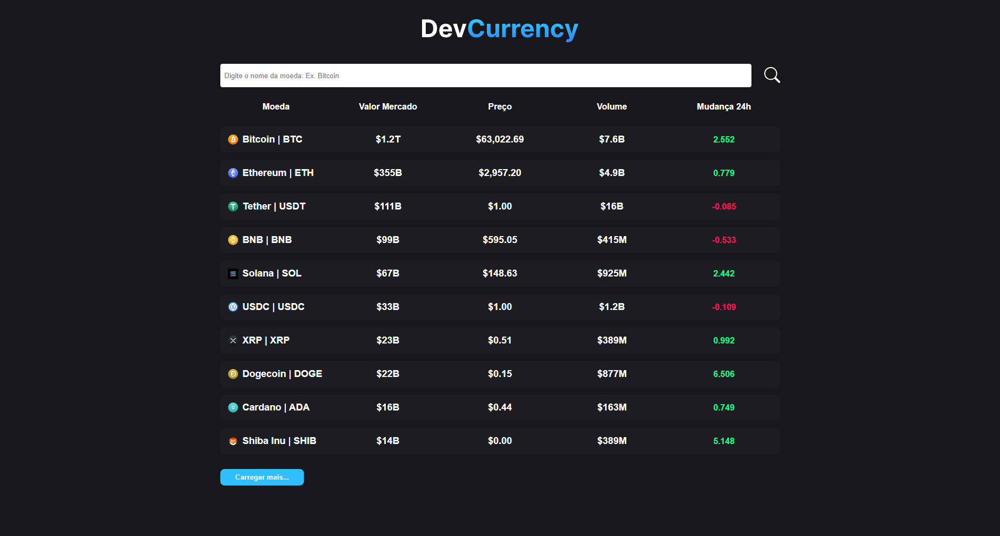

# Cripto App

My first react project using typescript.

In the app I also used an API to pull data from several cryptocurrencies such as their name and market value, and it was also the first project in which I used the git flow standard for commits.

App:

